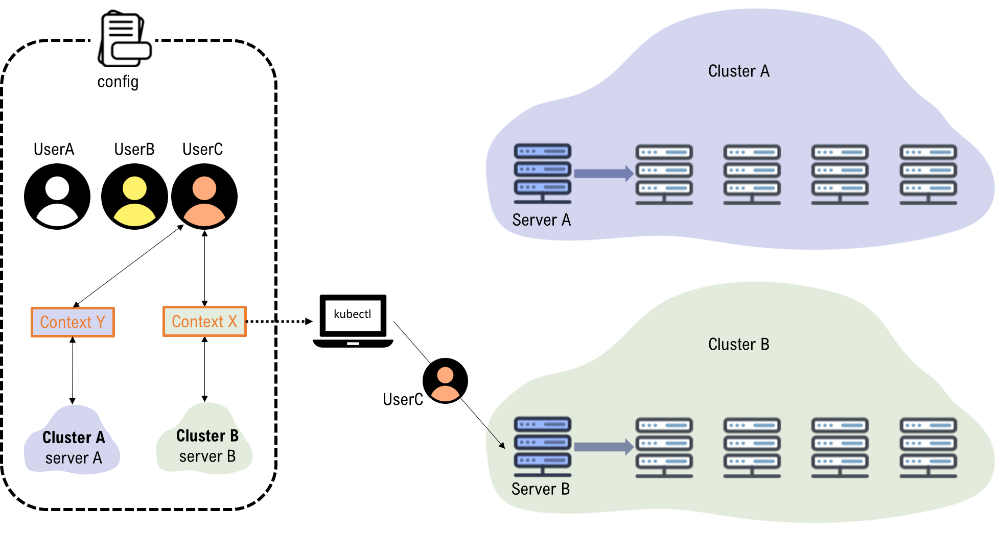
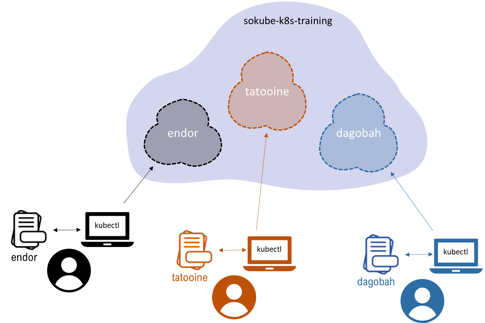

# LAB-K8S-01: Basic Setup

**Description**: This is an environment preparation lab where participants will install and configure the base tools to prepare a working environment for the following labs.

**Duration**: ±30m

## Goals
At the end of this lab, each participant will have:
- A working local environment to perform the k8s labs on a remote k8s cluster, inside its own namespace.

## Prerequisites

- Each participant has received personal pre-generated **kubectl config file** by email and the name of the corresponding **namespace**
- A laptop or station with Windows, MacOS or Linux
- A working Internet connection is necessary.

----

## Setup

- Create a working directory k8s-training that will serve as the root for the lab’s work

  ``` shell
  mkdir k8s-training
  cd k8s-training
  ```

- Download the version **1.16.6** of [kubectl](https://kubernetes.io/docs/tasks/tools/install-kubectl/#install-kubectl-on-linux) for your environment. Example for Linux:
  ``` shell
  curl -LO https://storage.googleapis.com/kubernetes-release/release/v1.16.6/bin/linux/amd64/kubectl
  ```

- Make the kubectl binary executable, and move the binary in a folder that is in the PATH variable, like **/usr/local/bin** (please note this requires the sudo priviledge)

  ``` shell
  chmod +x ./kubectl
  sudo mv ./kubectl /usr/local/bin/kubectl
  ```

- Verify **kubectl** is installed correctly on locally on your environment *(--client option won't try connect to the cluster)*:
  ``` shell
  kubectl version --client
  ```

- You should see:
   ``` shell
  Client Version: version.Info{Major:"1", Minor:"16", GitVersion:"v1.16.6",
  GitCommit:"72c30166b2105cd7d3350f2c28a219e6abcd79eb", GitTreeState:"clean",
  BuildDate:"2020-01-18T23:31:31Z", GoVersion:"go1.13.5", Compiler:"gc",
  Platform:"linux/amd64"}
  ``` 

## Kubectl Introduction

> The Kubernetes command-line tool, kubectl, allows you to run commands against Kubernetes clusters. You can use kubectl to deploy applications, inspect and manage cluster resources, and view logs. For a complete list of kubectl operations, see Overview of kubectl.

Kubectl relies on a **configuration file** that defines:
- multiple **clusters**, with the master URL (*server*) and their root public certificate to validate their authenticity. 
- multiple **users**, with their private and public keys. 
- multiple **contexts**, pairs of users+cluster that will be used for kubectl to know which identity to use to connect on a particular cluster. 

In the example below, the configuration file has defined:
- 2 **clusters**: *Cluster A*, accessible through its master node on *Server A*, and *Cluster B*, accessinble on *Server B*
- 3 **users**: *UserA*, *UserB* and *UserC*
- 2 **contexts**: *Context X* which represents *UserC* on *Cluster B*, and *Context Y*, which represents the same user for *Cluster A*.



The *Context X* being the default in the file, when kubectl performs a command, it will use the credentials of *UserC* and connect to *Cluster B* (using *Server B* URL)


## Kubectl Labs Configuration
Each participant has been assigned previously a given **namespace** on the target cluster to be able to work through the labs. In addition, a corresponding **kubectl config file** has been provided by email.



- Copy the file you’ve received on your computer in the k8s-training directory with name **k8s-training-config**, and test:
  ``` shell
  kubectl --kubeconfig=$HOME/k8s-training/k8s-training-config version
  ```

- You should have no connection error to the cluster, and both the client and server versions returned

  ``` shell
  Client Version: version.Info{Major:"1", Minor:"16", GitVersion:"v1.16.6",
   GitCommit:"72c30166b2105cd7d3350f2c28a219e6abcd79eb", GitTreeState:"clean",
   BuildDate:"2020-01-18T23:31:31Z", GoVersion:"go1.13.5", Compiler:"gc",
   Platform:"linux/amd64"}
  Server Version: version.Info{Major:"1", Minor:"16", GitVersion:"v1.16.6",
   GitCommit:"72c30166b2105cd7d3350f2c28a219e6abcd79eb", GitTreeState:"archive",
   BuildDate:"2020-03-24T13:01:23Z", GoVersion:"go1.13.5", Compiler:"gc",
   Platform:"linux/amd64"}
  ```

- To avoid the participant to specify the config file for each command, we will set the **KUBECONFIG** environment variable to point to our **k8s-training-config** file:
  ``` shell
  export KUBECONFIG=$HOME/k8s-training/k8s-training-config
  ```

- Test without specifying the file now, and get the cluster information
  ``` shell
  kubectl cluster-info
  ```
  Should return

  ``` shell
  Kubernetes master is running at https://node66447-sokube-k8s-training.hidora.com:11026
  KubeDNS is running at https://node66447-sokube-k8s-training.hidora.com:11026/api/v1/namespaces/kube-system/services/kube-dns:dns/proxy
  Metrics-server is running at https://node66447-sokube-k8s-training.hidora.com:11026/api/v1/namespaces/kube-system/services/https:metrics-server:/proxy

  To further debug and diagnose cluster problems, use 'kubectl cluster-info dump'.
  ```

**:cocktail: Congratulations, your lab environment is ready ! :cocktail:**

---
## Labs material
The labs material is accessible on github: https://github.com/sokube/kubernetes-training

You can clone the content with git:
``` shell
git clone git@github.com:sokube/kubernetes-training.git
```
Or download it as a [ZIP file](https://github.com/sokube/kubernetes-training/archive/master.zip) and uncompress it locally

---
## Kubernetes Documentation

The instructor will show you briefly how to use the reference documentation for kubernetes: https://kubernetes.io/docs/home/

---
## Quiz

- :white_check_mark: Give a quick look at the **configuration file** that has been provided and identify the various clusters, users and context information.
  ``` shell
  more k8s-training-config
  ```

- :white_check_mark: On which **port** will kubectl connect to the sokube-k8s-training cluster's master ?
- :white_check_mark: If you want to **impersonate** another participant, can you simply change the user name and execute a command ?
- :white_check_mark: What would you need ?

---

## More

Some links:
- [kubectl overview](https://kubernetes.io/docs/reference/kubectl/overview/)

