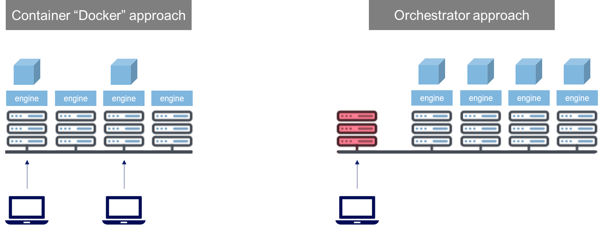

# LAB-K8S-02: Docker

**Description**: This is a very brief and rapid overview of Docker in the context of Kubernetes

**Duration**: ±30m

## Goals
At the end of this lab, each participant will have the basics of Docker refreshed

## Prerequisites

- A minimum exposure to Docker is a plus

----

## Docker Overview


Docker is a containerization solution based on 2 components hosted on a machine (physical or virtual)

- Docker **client**, which is used to pilot the main component:
- Docker **daemon**, the main server, which is responsible primarily to handle images, volumes, containers and handle the network aspects between containers and the host

It is important to differentiate the concepts of **image** and **container**. The image represents an inert binary "package" that will form the environment of the container (executables, libraries, etc..) whereas the container is an instance of an image, that is a living instance that has "deployed" a copy of the image packages to form its own individual environment.

The container lives in **isolation** from the rest of host environment, is usually restricted in ressources (CPU, Memory) by the host.

----

## Docker image

Docker images can be built by instructing the Docker daemon to compose an image based on a given set of parameters called the Dockerfile.

A typical Dockerfile will declare the following sections:
- FROM: which indicate the base image on which this image will build upon
- LABELS: which allow to store metadata in the image
- CMD: the command that will be executed upon container creation

Example:

```
FROM nginx:1.19.0-alpine

LABEL maintainer="Fabrice Vergnenegre <fabrice.vergnenegre@sokube.ch>" \
      io.k8s.description="Vitrine Sokube" \
      io.k8s.display-name="sokube-3d"

COPY static /usr/share/nginx/html

RUN chown -R nginx /usr/share/nginx/html/*

CMD ["nginx", "-g", "daemon off;"]
``` 


----

## Docker commands 
 
- Check the version :
  ``` shell 
  docker --version
  ``` 

- Check the running containers :
  ``` shell
  docker ps
  ```

- Check all containers, including the ones that have terminated:
  ``` shell
  docker ps -a
  ```

- Building an image from a Dockerfile :
  ``` shell
  docker build -t registry/imagename:tag . --no-cache
  ```

- Check the built images :
  ``` shell
  docker image ls
  ``` 

- Launching the image from the previously built image :
  ``` shell
  docker run -d --name my-app -p 127.0.0.1:8080:8080 -it registry/imagename:tag
  ``` 


- Deleting an image :
  ``` shell
  docker image rm 384aaafa7094
  ```

## Volumes

- List the existing volumes
  ``` shell
  docker volume ls
  ``` 

- Create a new volume called message:
  ``` shell
  docker volume create message
  ```

- As an example, use the following syntax in docker to use our volume **message** as a mount-point in /messages inside the container running the famous cowsay command, and will store the result in the volume. The content will we stored locally on the host and persist beyond the container life-cycle:
  ``` shell
  docker run -v message:/messages docker/whalesay bash -c "cowsay Hello From Sokube! > /messages/message.txt"
  ```

- Use the volume in another container and show the message
  ``` shell
  docker run -v message:/messages docker/whalesay cat /messages/message.txt
  ```

- Finally, deleting the message volume :
  ``` shell
  docker volume rm message
  ```

---

## Docker and Kubernetes

Keep in mind that an orchestrator is actually an additional layer on top of a set of nodes each having their container engine.

Also, Kubernetes is container engine **agnostic**, as long as the container engine used is compliant with the CRI specification. Docker is historically the most commonly used CRI around, but very valid and lightweight alternatives exist as well.



---

## Quiz

- What does the -d option in **docker run -d <image_name>** do ?
- What does **docker system prune** do ?
- What is the size of **Windows Nano Core** docker image ?
- What is the size of **alpine** docker image ?

---

## Next lab
 
 - [LAB-K8S-03 - PODs](../LAB-K8S-03/README.MD)
