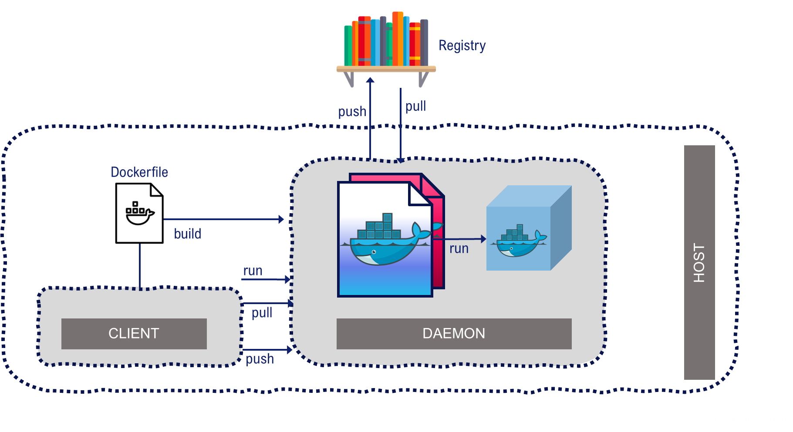

# LAB-K8S-02: Docker

**Description**: This is a very brief and rapid overview of Docker in the context of Kubernetes

**Duration**: ±20m

## Goals
At the end of this lab, each participant will have the basics of Docker refreshed

## Prerequisites

- A minimum exposure to Docker

----

## Docker Overview



Docker est une solution de containerization qui se base sur deux composants situés sur une machine hôte:

- Le Docker client (exécutable docker)

----

## Docker commands 
 
- Check the version :

``` shell 
docker --version
``` 

- Check the running containers :

``` shell
docker ps
```

- Building an image from a Dockerfile :
``` shell
docker build -t registry/imagename:tag . --no-cache
```

- Launching the image from the previously built image :
``` shell
docker run -d --name my-app -p 127.0.0.1:8080:8080 -it registry/imagename:tag
``` 

- Check the built images :
``` shell
docker image ls
``` 

- Deleting an image :
``` shell
docker image rm 384aaafa7094
```

## Volumes
- List the existing volumes: 
```
docker volume ls
``` 

- Create a new volume database-volume:
``` 
docker volume create database-volume
```

- As an example, use the following syntax in docker to use our volume database-volume as a mount-point in /var/lib/postgresql/data inside the container running the latest PostgreSQL version. The database content will we stored locally on the host and persist beyond the container life-cycle:

```
docker run -v database-volume:/var/lib/postgresql/data postgres
```

- Finally, deleting the database-volume volume :

```
docker volume rm database-volume
```