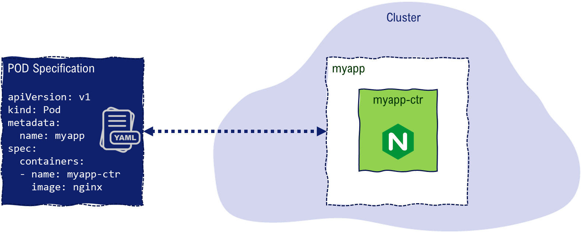

# LAB-K8S-03: PODs

**Description**: This is a lab dedicated to manipulation and exploration of POD objects, where participants will get familiar with PODs inside a cluster.

**Duration**: ±45m

## Goals
At the end of this lab, each participant will have:
- created, updated, deleted a POD using commands as well as YAML declarations..
- debugged a common error

## Prerequisites
 - [LAB-K8S-01 - Basic Setup](../LAB-K8S-01/README.MD)

----

## Exploring a POD

The instructor has created a POD inside your namespace ! Your task is to list the **pods** running in your namespace:
``` shell
kubectl get pods
```

- :white_check_mark: What is the **name** of the pod that has been created? 


#### POD Status
> - **Pending**: The Pod has been accepted by the Kubernetes system, but one or more of the Container images has not been created. This includes time before being scheduled as well as time spent downloading images over the network, which could take a while.
> - **Running**: The Pod has been bound to a node, and all of the Containers have been created. At least one Container is still running, or is in the process of starting or restarting.
> - **Succeeded**: All Containers in the Pod have terminated in success, and will not be restarted.
> - **Failed**: All Containers in the Pod have terminated, and at least one Container has terminated in failure. That is, the Container either exited with non-zero status or was terminated by the system.
> - **Unknown**: For some reason the state of the Pod could not be obtained, typically due to an error in communicating with the host of the Pod.
- :white_check_mark: What is the pod **status** ? 

#### POD node
Now run the same command with **-o wide** option:
``` shell
kubectl get pods -o wide
```
- :white_check_mark: On what **node** is this pod running ? 

#### POS details
In order to to look more thoroughly at a POD's details we need to use the kubectl *describe* command for pods.

``` shell
kubectl describe pod welcome
```

``` shell
Name:         welcome
Namespace:    tatooine
Priority:     0
Node:         node66449-sokube-k8s-training.hidora.com/10.102.9.82
Start Time:   Sun, 07 Jun 2020 14:08:43 -0700
Labels:       org=sokube
Annotations:  <none>
Status:       Running
IP:           10.239.0.16
IPs:
  IP:  10.239.0.16
Containers:
  welcome:
    Container ID:  docker://0d8eaf9fc29d4a7d0a008439fef5588151633c9e706b79385b7fbfe41a023faa
    Image:         busybox
    Image ID:      docker-pullable://busybox@sha256:95cf004f559831017cdf4628aaf1bb30133677be8702a8c5f2994629f637a209
    Port:          <none>
    Host Port:     <none>
    Command:
      /bin/sh
      -c
    Args:
      echo "welcome on $PLANET" > /welcome.txt; sleep 3600
    State:          Running
      Started:      Sun, 07 Jun 2020 14:08:47 -0700
    Ready:          True
    Restart Count:  0
    Environment:
      PLANET:  tatooine
    Mounts:
      /var/run/secrets/kubernetes.io/serviceaccount from default-token-b2sfc (ro)
Conditions:
  Type              Status
  Initialized       True 
  Ready             True 
  ContainersReady   True 
  PodScheduled      True 
Volumes:
  default-token-b2sfc:
    Type:        Secret (a volume populated by a Secret)
    SecretName:  default-token-b2sfc
    Optional:    false
QoS Class:       BestEffort
Node-Selectors:  <none>
Tolerations:     node.kubernetes.io/not-ready:NoExecute for 300s
                 node.kubernetes.io/unreachable:NoExecute for 300s
Events:
  Type    Reason     Age        From                                               Message
  ----    ------     ----       ----                                               -------
  Normal  Scheduled  <unknown>  default-scheduler                                  Successfully assigned dagobah/welcome to node66449-sokube-k8s-training.hidora.com
  Normal  Pulling    13s        kubelet, node66449-sokube-k8s-training.hidora.com  Pulling image "busybox"
  Normal  Pulled     11s        kubelet, node66449-sokube-k8s-training.hidora.com  Successfully pulled image "busybox"
  Normal  Created    10s        kubelet, node66449-sokube-k8s-training.hidora.com  Created container welcome
  Normal  Started    10s        kubelet, node66449-sokube-k8s-training.hidora.com  Started container welcome
```

- :white_check_mark: What is **image** used by the container in this pod ?
- :white_check_mark: What does this container do exactly ? (check **command**)
- :white_check_mark: Where does it output text ?

#### Executing commands in a POD container

With the **kubectl exec** command, we can execute commands remotely into the containers of specified pods. Here we run an interactive shell session (/bin/sh) into the unique container of the POD.

``` shell
kubectl exec -it welcome -- /bin/sh
```

- :white_check_mark: Can you show the content of the file ?
``` shell
/ # ls
bin          etc          proc         sys          usr          welcome.txt
dev          home         root         tmp          var
/ # more welcome.txt
welcome on ...........
/ # exit
```
#### Restart Policy

> A PodSpec has a restartPolicy field with possible values Always, OnFailure, and Never. The default value is Always. restartPolicy applies to all Containers in the Pod. restartPolicy only refers to restarts of the Containers by the kubelet on the same node. Exited Containers that are restarted by the kubelet are restarted with an exponential back-off delay (10s, 20s, 40s …) capped at five minutes, and is reset after ten minutes of successful execution.

- :white_check_mark: What value in in the pod **restartPolicy**?
- :white_check_mark: Can you confirm ? How ?

#### POD as YAML

- Extract the POD's in the **YAML format**, for future usage:

``` shell 
kubectl get pod welcome -o=yaml > welcome.yaml
``` 

- :white_check_mark: Have a look at welcome.yaml, do you think we have only the strict minimum content necessary to create a POD here?

#### Delete a POD
Now we can work on our own PODs, delete the welcome pod:

``` shell 
kubectl delete pod welcome
``` 

----
## Creating your first POD

#### Declarative vs Imperative
> :bulb: **Declarative vs Imperative**
>
>  **Declarative :** Description of a desired state, the system (Docker, Kubernetes ...) will try to reach this state in time. 
> **Imperative/Procedural :** Control of the final state.

- Example of the **imperative**  command use to deploy a pod :
  ``` shell
  kubectl run --generator=run-pod/v1 my-app-example --image=nginx:latest
  ```

- A **declarative** approach would be to describe the desired state in a file.


  The desired state is given to the kubernetes cluster with the **apply** command:

   ```  shell
   kubectl apply -f my-app-example-2.yml
   ```

- Let's delete one of the pods, the other one will serve us in a future exercise.

   ```  shell
   kubectl delete pods my-app-example
   ```

----

## Explore your Landing Zone

Inside your namespace, the instructor has initialized a set of kubernetes objects that will allow you to see your namespace's applications using a browser. We won't have a look at them immediately in the labs, but it is important for you to not alter them before.

:warning: DO NOT ALTER the service **sokube-k8s-training-\<YOURNAMESPACE\>-landingzone-svc** in your namespace or you might not be able to see your POD :warning:

- :white_check_mark: Open a browser and look at your **landing zone**: https://sokube-k8s-training.hidora.com/YOURNAMESPACE/ 
- :white_check_mark: What do you see ?

The current landing zone is actually redirecting the URL of your landing zone to a POD with the following criteria:
> - Running on container port **8080**
> - Having a label **app** with value **simple-todo**

- :white_check_mark: Do we have such a POD in our namespace ?

Our application team has provided us at the last minute a **pod declaration** file for the application, given in the simple-todo-pod.yml file at the root of this lab.

- :white_check_mark: Try to create the POD
  ``` shell
  kubectl create -f simple-todo-pod.yml
  ``` 
- :white_check_mark: Can you correct the errors in this file ? (**solution** [here](./solutions/simple-todo-pod-corrected.yml))

- :white_check_mark: Reopen your langing zone and confirm you see the application

----

## Environment variables

The default landing zone todo application feels very generic and does not reflect your landing zone.

Our application developers have included the possibility to customize the header to change the owner organization of the todo application, by using the environment variable **ORG**.

- :white_check_mark: Read the [documentation](https://kubernetes.io/docs/tasks/inject-data-application/define-environment-variable-container/) on environment variables

- :white_check_mark: Modify the declaration file to include an environment variable **ORG** with the value of your namespace

## Next lab
 
 - [LAB-K8S-04 - Services](../LAB-K8S-04/README.MD)
