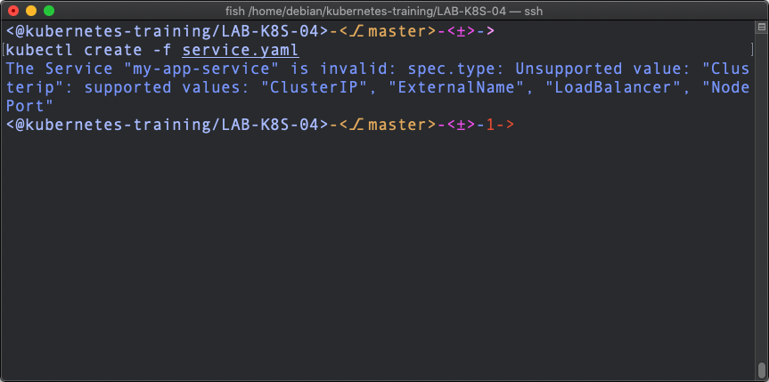
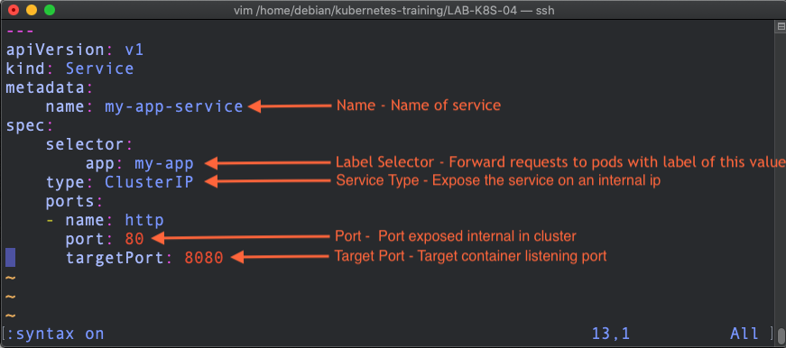

# LAB-K8S-04: Services

**Description**: In this lab, participants will learn how to use services, get to know their different types and learn about debugging

**Duration**: *±30m*

## Goals

*List the goals using bullet point per goal, eg:

At the end of this lab, each participant will have:*

- Creating and editing a Service Object.

- Synthax errors debugging.


## Prerequisites

*List prerequisites using bullet point per goal, eg:*

*- Each participant has received personal pre-generated kubectl config file by email and the name of the corresponding **namespace***

*- A laptop or station with Windows, MacOS or Linux and a working Internet connection are necessary.*

---


## Creating a service

-   As a first step, before creating our first service, we will inspect the service.yaml file with the :
    
    
```
$ cat /LAB-K8S-04-services/service.yaml
```

-   In this second step, we will edit this file with vim to specify the type of service we want (ClusterIP) :
    
```
$ vim service.yaml
```
---
> **TIPS:** The **YAML** is used for configuration files :
> Don't forget that .yaml files have the particularity of having an indentation exclusively with **spaces** and not **tabulations**.
---
| TYPES | USAGES |
|--|--|
| ClusterIP | Expose the service on an internal ip (default type) |
| NodePort | Expose the service on the IP of each node |
| LoadBalancing | The process of efficiently distributing network traffic between multiple services |

---
-   Your file should look like the file below :
    


>**Tips 1 :** Save your file with :
```
:wq
```

>**Tips 2 :** To enable line numbers on the vim editor, just enter :

```
:set nu + enter
```
---
-   **Well Done !** It's time to deploy this service :
    

```
kubectl create -f service.yaml
```



-   It’s a **TRAP** ! Or **NOT**, there's just "one" more thing missing (Look at this image and make a comparison of your description file) :
    


-   What do you think ? (Find errors, fix them and create a new kubectl -f service.yaml)

-   Let's go see if everything went well :
    
```
kubectl get services
```


!!! ### ADD N-E (Invert Port/TargetPort) !!!  
