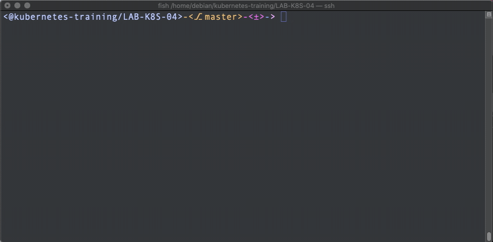

# LAB-K8S-04: Services

**Description**: In this lab, participants will learn how to use services, get to know their different types and learn about debugging

**Duration**: *±30m*

## Goals

*List the goals using bullet point per goal, eg:

At the end of this lab, each participant will have:*

- Creating and editing a Service Object.

- Synthax errors debugging.


## Prerequisites
 - [LAB-K8S-01 - Basic Setup](../LAB-K8S-01/README.MD)
 - [LAB-K8S-03 - PODs](../LAB-K8S-03/README.MD)


## Service


### Creating a Service :

- Open https://kubernetes.io/docs/concepts/services-networking/connect-applications-service/#creating-a-service and read the example Service specification.

>**Tips 1 :** Save your file with :
```
:wq
```

>**Tips 2 :** To enable line numbers on the vim editor, just enter :

```
:set nu + enter
```
---

- Create a Service inside your namespace that will match the following specifications (solution here) :
  - name --> service-my-todo-list
  - selector --> app: my-todo-list
  - type --> ClusterIP
  - port --> 80
  - targetPort --> 8080
  
> **TIPS:** The **YAML** is used for configuration files :
> Don't forget that .yaml files have the particularity of having an indentation exclusively with **spaces** and not **tabulations**.
---
| TYPES | USAGES |
|--|--|
| ClusterIP | Expose the service on an internal ip (default type) |
| NodePort | Expose the service on the IP of each node |
| LoadBalancing | The process of efficiently distributing network traffic between multiple services |

---
  
- Deploy this newly created file :
    $ kubectl create -f service-my-todo-list.yml
    
- Let's make sure it was created :
    $ kubectl get services
    
- Congratulations, but it's not over yet. That would have been too simple. It turns out that in a hurry, we deployed a service that didn't seem to work... I'll let you see that.
       
```
$ cat /LAB-K8S-04-services/service-with-bugs.yml
```

-  It's a trap... A real storm came through here... Correct all these mistakes!
    
```
$ vim service.yml
```

```
$ mv service-with-bugs.yml service.yml
```

---

-  **Well Done !** It's time to deploy this service :
    

```
kubectl create -f service.yaml
```

-   Let's go see if everything went well :
    
```
kubectl get services
```


