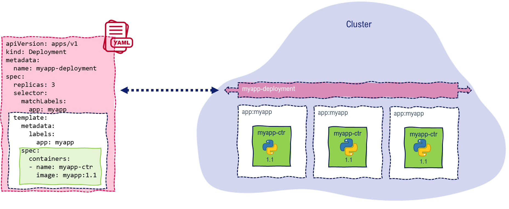

# LAB-K8S-05: Deployment

**Description**: For this lab, the participants will learn how to use Deployments inside Kubernetes, and will practise roll-outs of new versions as well as roll-backs.

**Duration**: ±45m

## Goals
At the end of this lab, each participant will be able to roll-out and roll-back a new version of an application with a Deployment object both in imperative and declarative ways.

## Prerequisites
 - [LAB-K8S-01 - Basic Setup](../LAB-K8S-01/README.MD)
 - [LAB-K8S-03 - PODs](../LAB-K8S-03/README.MD)

---

## Trouble with the force
- :white_check_mark: Look at your application using your landing zone, eg: https://sokube-k8s-training.hidora.com/tatooine.
- :white_check_mark: Is it still running ?

---
## Liveness Probe
Our application is still in early development and some areas are still buggy. In particular we know our application is sometimes slowing down unexpectedly until being totally useless. Kubernetes has a built-in mechanism to decide upon POD status (and restart mechanisms) for non responsive applications : **liveness probes**.

> The kubelet uses liveness probes to know when to restart a container. For example, liveness probes could catch a deadlock, where an application is running, but unable to make progress. Restarting a container in such a state can help to make the application more available despite bugs.

- :white_check_mark: Read [Configure Liveness, Readiness and Startup Probes](https://kubernetes.io/docs/tasks/configure-pod-container/configure-liveness-readiness-startup-probes/#define-a-liveness-http-request)

In a :fire: **hurry** :fire:  and while the issue is investigated, our application developers have introduced a **new HTTP REST** endpoint (available at **/health**) in the application to allow for an external probe.

- :white_check_mark: Update the image  of your POD to **sokubedocker/simple-todo:1.1**, using the **declarative** method (remember we used a YAML in [LAB-K8S-02](../LAB-K8S-02/README.MD)). **Solution** [here](./solutions/simple-todo-pod-emergency.yaml).

- :white_check_mark: Try the new application new REST service with your landing zone's URL, eg: https://sokube-k8s-training.hidora.com/tatooine/health, what is it answering ?

Let's use what we've learned about liveness probes and implement one leveraging this new REST endpoint.

- :white_check_mark: Complement the previous POD declaration with the liveness probe specs below and apply it. Try your new application. **Solution** [here](./solutions/simple-todo-pod-liveness.yaml).
  - The check will has to be run periodically **each 5s**
  - The HTTP url to use is **/health** on **port 8080**
  - A request taking more than  **1s** means our application can be considered non-responsive, and must be restarted
  - We want to avoid deciding liveness while the application is starting, so we'll give the application a **grace period of 5s** before starting the probe

Is our liveness probe solving the problem ? The instructor will remotely have your application suddenly slow unexpectedly.

- :white_check_mark: Watch your pod:
``` shell
watch kubectl get pod simple-todo-pod --namespace=tatooine
``` 
- :white_check_mark: Is it **restarting** ?
- :white_check_mark: Check your application with your landing zone URL, eg: https://sokube-k8s-training.hidora.com/tatooine/. Is it **available** ?

---

## Using Deployments
 
Deployments are the controlled way to express desired states of your applications and let kubernetes system handle the changes to bring to the actual state.



First, let's **cleanup** our environment:
- :white_check_mark: Kill the previously created POD. 

#### Creating a Deployment

:white_check_mark: Open https://kubernetes.io/docs/concepts/workloads/controllers/deployment/#creating-a-deployment and read the example deployment specification.

:white_check_mark: Create a **deployment** inside your namespace that will match the following specifications (**solution** [here](./solutions/simple-todo-pod-deployment.yaml)) :

  - **name** is my-todo-deployment
  - 1 replica of a POD that has the label **app:simple-todo**
  - POD's specification remains the same:
    - **image** to use for the POD's container is sokubedocker/simple-todo:1.1
    - **port** is 8080
    - **labels** must have the key:value pair app:simple-todo
    - **liveness** probe must be defined

:white_check_mark: Use the **kubectl create** command to create your **deployment**.
``` shell
kubectl create -f <filename>
```

:white_check_mark: List the **deployments** in your namespace
``` shell
kubectl get deployment
```

Look at the **Ready** column:
- :white_check_mark: How many POD's should the deployment have?
- :white_check_mark: How many are ready ?

Go to your landing zone URL, eg: https://sokube-k8s-training.hidora.com/tatooine/.
  - :white_check_mark: Look at the footer section. What has changed in the **hostname** ?
----
## Upgrades and rollbacks

Development is going full speed and our team has come up with a much awaited feature: *completion for tasks*. They've just released version 2.0. We'll use our deployment to perform an upgrade to this version.

- :white_check_mark: Modify the previous deployment declaration and update the image to **sokubedocker/simple-todo:2.0** (**solution** [here](./solutions/simple-todo-pod-deployment-newfeature.yaml))

- :white_check_mark: Check the status of our **deployment** object:
``` shell
kubectl rollout status deployment my-app-deployment
``` 
- :white_check_mark: Check the history of our **deployment** object (note: our target cluster has limited the number of revisions to 2):
``` shell
kubectl rollout history deployment my-app-deployment
``` 

Go to your landing zone URL, eg: https://sokube-k8s-training.hidora.com/tatooine/, and play a bit with the new completion feature. Imagine that this version contains a major issue and we need to revert to the previous 1.1 version. 
  - :white_check_mark: Perform a deployment rollback:
``` shell
kubectl rollout undo deployment my-app-deployment
``` 
----
## Scaling

One of the roles of the **Deployment** object (and the controller that handles it) is to maintain a desired number of PODs (called replicas). 

In the meantime our todo application is gaining attention and more and more users start to leverage it. Our application **still being affected by the unresponsiveness issue**, we got couple of customers who have been noticing out-of-service response by our application (while it was restarting). We want to make sure we have **permanently 2 instances** of the application running.

- :white_check_mark: Modify the **replicas** field in the deployment YAML to have permanently 2 instances of our application in version 1.1 (**solution** [here](./solutions/simple-todo-pod-deployment-scaling.yaml))

Look at the footer section and perform couple of browsers refresh... 
- :white_check_mark: What is changing in the **hostname** ?
- :white_check_mark: Try to modify the todo list, and perform some refreshes. What is the main **architectural problem** of our solution ? (tip: stateless applications vs stateful applications)
- :white_check_mark: Scale down the application **to 1 replica** while we revisit the architecture to address the stateless problem of our application
