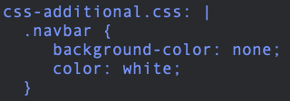

# LAB-K8S-06: ConfigMaps

**Description**: In this lab, participants will learn how to use ConfigMap, as a first step, a configMap (css file) that will overwrite the existing files.

**Duration**: ±40m

## Goals
At the end of this laboratory, each participant will be able to set up a configMap and its volume to simply modify configurations such as for example a virtual host, an application configuration file etc...

## Prerequisites
 - [LAB-K8S-01 - Basic Setup](../LAB-K8S-01/README.MD)
 - [LAB-K8S-03 - PODs](../LAB-K8S-03/README.MD)
 - [LAB-K8S-04 - Services](../LAB-K8S-04/README.MD)
 - [LAB-K8S-05 - Deployments](../LAB-K8S-05/README.MD)
---

## Trouble with the force
-
-

---
## ConfigMap
When you start developping/integrating an application, what a pleasure to be able to modify parameters in one or more configuration files without having to completely rebuild an image.

A traditional approach is to decorrelate application code from its configuration. (key/value)

And that's where **configMaps** come in.

>**WARN :** A configMap must not contain sensitive data.

 - Read [Concepts - ConfigMaps](https://kubernetes.io/docs/concepts/configuration/configmap/)
 
It's time to create our first configMap :

### Creating a ConfigMap :

The goal here will be to set up a configmap that will feed a css stylesheet that will override the style of your future application.

- Open [https://kubernetes.io/docs/concepts/configuration/configmap/#configmaps-and-pods](https://kubernetes.io/docs/concepts/configuration/configmap/#configmaps-and-pods) and read the example configMap specification.

- Create a  **configMap**  inside your namespace that will match the following specifications (**solution**  [here](https://github.com/sokube/kubernetes-training/blob/master/LAB-K8S-06/solutions/)) :
- Specifications : 

	- name is configmap-css-additionnal
	- data with content (You can change it in *style* later) :

--- 
| CHARACTER | SHORTCUT | USAGE |
|--|--|--|
| > | MAJ + < | Single-line format |
| \| | ALT-G + 6 | Multi-line format |

Examples : 

    apiVersion: v1
    kind: ConfigMap
    metadata:
      name: example
      labels:
        app: example
    data:
      example-single-line.yml: > Single-line example
	
    ---
    
    apiVersion: v1
    kind: ConfigMap
    metadata:
      name: example-multi-line
      labels:
        app: example-multi-line
    data:
      example-multi-line.yml: | 
	  key1:
	    value1: 'example1'
	  key2:
	    value2: 'example1'
	  
---
