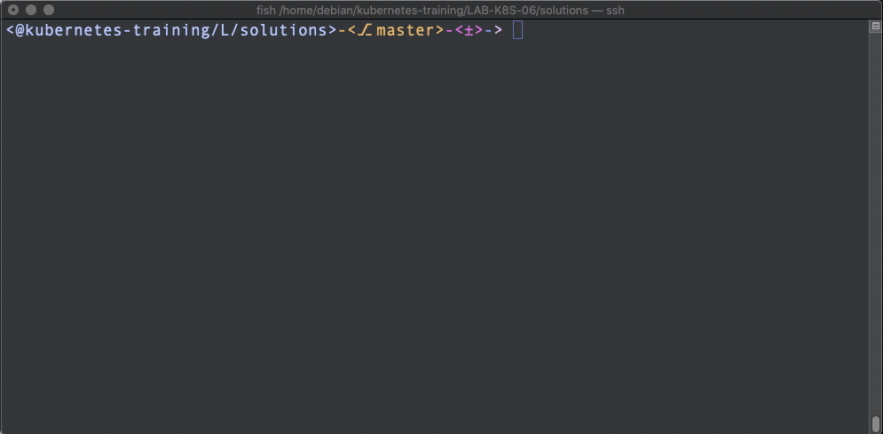

# LAB-K8S-06: ConfigMaps

⚠️ MODIFICATION IMAGE + CONFIGMAPENV + RELECTURE A FAIRE + TESTS A FAIRE ⚠️

**Description**: In this lab, participants will learn how to use ConfigMap, as a first step, a configMap (css file) that will overwrite the existing files.

**Duration**: ±40m

## Goals
At the end of this laboratory, each participant will be able to set up a configMap and its volume to simply modify configurations such as for example a virtual host, an application configuration file etc...

## Prerequisites
 - [LAB-K8S-01 - Basic Setup](../LAB-K8S-01/README.MD)
 - [LAB-K8S-03 - PODs](../LAB-K8S-03/README.MD)
 - [LAB-K8S-04 - Services](../LAB-K8S-04/README.MD)
 - [LAB-K8S-05 - Deployments](../LAB-K8S-05/README.MD)

---
## ConfigMap
When you start developping/integrating an application, what a pleasure to be able to modify parameters in one or more configuration files without having to completely rebuild an image.

A traditional approach is to decorrelate application code from its configuration. (key/value)

And that's where **configMaps** come in.

>**WARN :** A configMap must not contain sensitive data.

 - Read | [Concepts - ConfigMaps](https://kubernetes.io/docs/concepts/configuration/configmap/)
 
It's time to create our first configMap :



### Creating a ConfigMap :

The goal here will be to set up a configmap that will feed a css stylesheet that will override the style of your future application.

- Open [https://kubernetes.io/docs/concepts/configuration/configmap/#configmaps-and-pods](https://kubernetes.io/docs/concepts/configuration/configmap/#configmaps-and-pods) and read the example configMap specification.

- Create a  **configMap**  inside your namespace that will match the following specifications (**solution**  [here](https://github.com/sokube/kubernetes-training/blob/master/LAB-K8S-06/solutions/01-simple-todo-configmap.yml)) :
- Specifications : 

	- name is configmap-css-additionnal
	- data with content (You can change it in *style* later) :


- Deploy this newly created file : 
``` shell
    $ kubectl create -f configmap-css-additional.yml
```
- Let's make sure it's been created :
``` shell
    $ kubectl get configmaps
```    
- Congratulations, now we'll have to make sure to declare our configmap volume in our deployment : 

 - Retrieve the deployment you have used in the past :
``` shell
kubectl get deployment my-todo-deployment -o yaml > my-todo-deployment.yml
```

- Add a **volume** and **volumeMount** based on the following official documentation : Read | [Populate a Volume with data stored in a ConfigMap
](https://kubernetes.io/docs/tasks/configure-pod-container/configure-pod-configmap/#populate-a-volume-with-data-stored-in-a-configmap)
> mountPath must match : /usr/src/app/static/css/css-additional (**solution**  [here](https://github.com/sokube/kubernetes-training/blob/master/LAB-K8S-06/solutions/02-simple-todo-pod-deployment-configmap.yml)) :

- Once finished, apply the new configuration of your deployment :

``` shell
    $ kubectl apply -f my-todo-deployment.yml
```
- A little routine check :

``` shell
    $ kubectl get deployments -o wide -w
```

``` shell
    $ kubectl get pods -o wide -w
```

#### Using ConfigMaps as an Environment variables

We can create also **ConfigMaps** with the imperative way:

``` shell
kubectl create configmap configmap-single-env --from-literal=name=HanSolo
```

And use the value of the config map inside an **Environment** variable.

- :white_check_mark: Check [documentation](https://kubernetes.io/docs/tasks/configure-pod-container/configure-pod-configmap/#define-container-environment-variables-using-configmap-data)
- :white_check_mark: Rework the deployment file to use the value of the key: **name** from the configmap **configmap-single-env** in our application container **ORG** environment variable (solution [here](./solutions/02-simple-todo-pod-deployment-configmap-env.yml))
 

#### Using ConfigMaps for multiple variables

We've seen in the first section how to use ConfigMaps directly **mounted as volumes** which result in a structure of files named by config map keys and containing the corresponding values. We've also seen how to pick an individual environment variable values from a specific configmap key's value.

As part of this new application release, the application team has included a dedicated page for the landing zone specific planet.

- :white_check_mark: Check it out (navigation menu)

By default, it shows the **Tatooine** information, but our application team has provided a way to customize with the following environment variables:
>- SW_PLANET
>- SW_CLIMATE
>- SW_TERRAIN
>- SW_POPULATION
>- SW_RESIDENT

We don't want to declare and map these enviroment **variables one by one**, as it would be really long and would result in a complex declaration file. Fortunately, Kubernetes provides a way to declare a set of environment variables with their names and values coming from a ConfigMap.

- :white_check_mark: Read the [documentation](https://kubernetes.io/docs/tasks/configure-pod-container/configure-pod-configmap/#configure-all-key-value-pairs-in-a-configmap-as-container-environment-variables) on how to use this particular notation
- :white_check_mark: If you can't provide all StarWards planets information, you use this [link](https://swapi.dev/api/planets/) and look for the following information: 
	- Planet name
	- Climate
	- Terrain
	- Population
	- Name of a resident of this planet

- :white_check_mark: Create a configmap with the following specifications (**solution**  [here](https://github.com/sokube/kubernetes-training/blob/master/LAB-K8S-06/solutions/03-simple-todo-configmap-env.yml)) : 

> - name is **configmap-multiple-env**
> - data with correct content:
> SW_PLANET: "Tatooine"
> SW_CLIMATE: "Arid"
> SW_TERRAIN: "Desert"
> SW_INFO_POPULATION: "200000"
> SW_INFO_RESIDENT: "Beru Whitesun lars"

- :white_check_mark: Deploy this newly created file : 
  ``` shell
  kubectl create -f configmap-env-multiple.yml
  ```

- :white_check_mark: Verify it's been created :
  ``` shell
  kubectl get configmaps
  ```

Now we need to modify our deployment to use our configmap as environment variables for our container:

- :white_check_mark: Retrieve the deployment you have used in the past :
  ``` shell
  kubectl get deployment my-todo-deployment -o yaml > my-todo-deployment.yml
  ```

- :white_check_mark: Rewrite the environment section to use the configmap as a reference. (**solution**  [here](./solutions/04-simple-todo-pod-deployment-configmap-env-multiple.yml))

- :white_check_mark: Apply the changes:
  ``` shell
  kubectl apply -f my-todo-deployment.yml
  ```
- :white_check_mark: Verify on your landing page's dedicated planet section

:cocktail: **Congratulations, that's it for the configMaps, let's move on to Secrets.**:cocktail:

--- 
## Tips

| USAGES | EXAMPLES |
|--|--|
| --from-literal | sw.parameters.hero: 'Dark Vador!' |
| --from-file | sw.parameters.file: \|-  
| | sw.parameters.hero.1 = 'Dark Vador!' |
| | sw.parameters.hero.2 = 'Luke' |

| CHARACTER | SHORTCUT | USAGE |
|--|--|--|
| > | MAJ + < | Single-line format |
| \| | ALT-G + 6 | Multi-line format |

Examples : 

    apiVersion: v1
    kind: ConfigMap
    metadata:
      name: example
      labels:
        app: example
    data:
      example-single-line.yml: > Single-line example
	
    ---
    
    apiVersion: v1
    kind: ConfigMap
    metadata:
      name: example-multi-line
      labels:
        app: example-multi-line
    data:
      example-multi-line.yml: | 
	  key1:
	    value1: 'example1'
	  key2:
	    value2: 'example1'
	  
---
## Next lab
- 