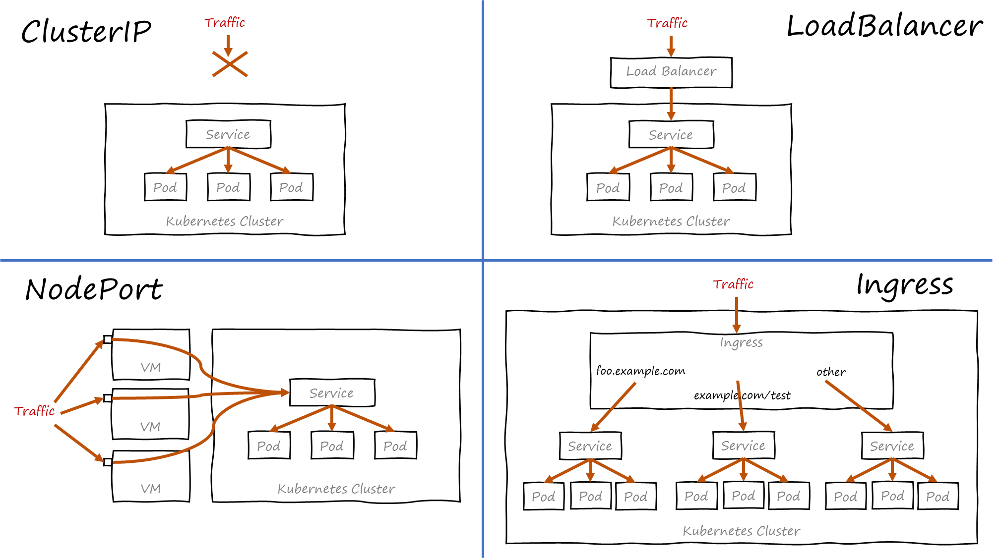

# LAB-K8S-10: Ingress

**Description**: In this lab, we will manipulate an Ingress and see how this helps us to expose and route properly the external traffic inside our cluster, though services and down to PODs.

**Duration**: ±60m

## Goals
Understand the differences between ClusterIP, NodePorts, LoadBalancer and an Ingress. manipulate an Ingress.

## Prerequisites
 - [LAB-K8S-01 - Basic Setup](../LAB-K8S-01/README.MD)
 - [LAB-K8S-03 - PODs](../LAB-K8S-03/README.MD)
 - [LAB-K8S-04 - Services](../LAB-K8S-04/README.MD)
 - [LAB-K8S-05 - Deployments](../LAB-K8S-05/README.MD)
 - [LAB-K8S-06 - ConfigMaps](../LAB-K8S-06/README.MD)
 
---
## Overview 

How different Services and Ingress handle external traffic (please note that **Ingress is not a Service**)

(https://medium.com/google-cloud/kubernetes-nodeport-vs-loadbalancer-vs-ingress-when-should-i-use-what-922f010849e0)

Ingress can be seen as a powerful way to funnel and route the traffic inside your cluster to multiple different services, without having to provide 1 external LoadBalancer or NodePort for each and every service.

Similarly as a Deployment needs a DeploymentController to handle the states changes, an Ingress needs an IngressController to manage its state.

Depending on the Kubernetes distribution, there might be different default [Ingress Controllers](https://kubernetes.io/docs/concepts/services-networking/ingress-controllers/) for your clusters. The one inside the cluster for the labs is based on the nginx ingress controler.

Example of an Ingress (for the tatooine landing zone):

```
---
apiVersion: extensions/v1beta1
kind: Ingress
metadata:
  annotations:
    kubernetes.io/ingress.class: nginx
    nginx.ingress.kubernetes.io/ssl-redirect: "false"
    nginx.ingress.kubernetes.io/rewrite-target: /$2
  name: sokube-k8s-training-tatooine-landingzone-ingress
  namespace: tatooine
spec:
  rules:
  - http:
      paths:
      - backend:
          serviceName: sokube-k8s-training-tatooine-landingzone-svc
          servicePort: 80
        path: /alderaan(/|$)(.*)
```

--- 

### Exercise :

✅ Based on all the chapters before, create a new deployment, a new service, and an ingress (at /namespace-demo).
- image: **sokubedocker/songinx:1.0**
- **1 replica** of a pod
- accessible through an ingress on **/\<YOURNAMESPACE\>-demo**

✅ Bonus: Look at the exposed pod html, and with a ConfigMap object, replace the 2 images (hint: there's a link to an additional css file in the html header...)
