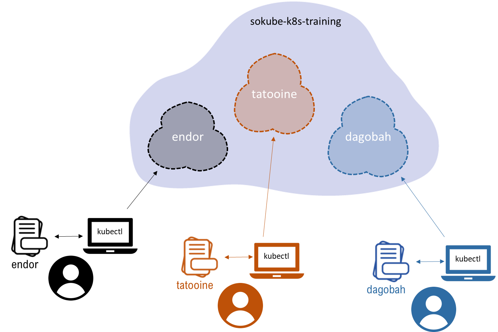

# LAB-K8S-01: Basic Setup

**Description**: This is an environment preparation lab where participants will install and configure the base tools to prepare a working environment for the following labs.

**Duration**: ±20m

## Goals
At the end of this lab, each participant will have:
- a working local environment to perform the k8s labs on a remote k8s cluster, inside its own namespace.

## Prerequisites

- Each participant has received personal pre-generated kubectl config file by email and the name of the corresponding **namespace**
- A laptop or station with Windows, MacOS or Linux and a working Internet connection are necessary.

## Setup

- Create a working directory k8s-training that will serve as the root for the lab’s work

```shell
mkdir k8s-training
cd k8s-training
```

- Download the version 1.16.6 or latest of [kubectl](https://kubernetes.io/docs/tasks/tools/install-kubectl/#install-kubectl-on-linux) for your environment. Example for Linux:
```
curl -LO https://storage.googleapis.com/kubernetes-release/release/v1.16.6/bin/linux/amd64/kubectl
```

- Make the kubectl binary executable
```shell
chmod +x ./kubectl
```

- Move the binary in a folder that is in the PATH variable, like **/usr/local/bin** (please note this requires the sudo priviledge)
```
sudo mv ./kubectl /usr/local/bin/kubectl
```

- Verify kubectl is installed correctly on locally on your environment (--client)

```
kubectl version --client
```
- You should see
```
Client Version: version.Info{Major:"1", Minor:"16", GitVersion:"v1.16.6", GitCommit:"72c30166b2105cd7d3350f2c28a219e6abcd79eb", GitTreeState:"clean", BuildDate:"2020-01-18T23:31:31Z", GoVersion:"go1.13.5", Compiler:"gc", Platform:"linux/amd64"}
``` 

## Kubectl Configuration
Each participant has been assigned previously a given **namespace** on the target cluster to be able to work through the labs. In addition, a corresponding kubectl config file has been provided by email.



- Copy the file you’ve received on your computer in the k8s-training directory with name **k8s-training-config**, and test:
```
kubectl --kubeconfig=$HOME/k8s-training/k8s-training-config get pods
```
- You should have no connection error to the cluster, and no resources found in the **your-namespace** namespace:
```
No resources found in tatooine namespace.
```

- To avoid the participant to specify the config file for each command, we will set the **KUBECONFIG** environment variable to point to our **k8s-training-config** file:
```
export KUBECONFIG=$HOME/k8s-training/k8s-training-config
```
- Test without specifying the file:
```
kubectl get pods
```
- Should result in:
```
No resources found in tatooine namespace.
```

Congratulations, your lab environment is ready!