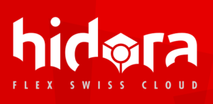

# Kubernetes Training

Our training labs infrastructure is graciously provided by our partner:

# Available Labs :

 - [LAB-K8S-01 - Basic Setup](./LAB-K8S-01/README.MD)
 - [LAB-K8S-02 - Docker](./LAB-K8S-02/README.MD)
 - [LAB-K8S-03 - PODs](./LAB-K8S-03/README.MD)
 - [LAB-K8S-04 - Services](./LAB-K8S-04/README.MD)
 - [LAB-K8S-05 - Deployment](./LAB-K8S-05/README.MD)
 - [LAB-K8S-06 - ConfigMaps](./LAB-K8S-06/README.MD)
 - [LAB-K8S-07 - Secrets](./LAB-K8S-07/README.MD)
 - [LAB-K8S-08 - Persistence](./LAB-K8S-08/README.MD)
